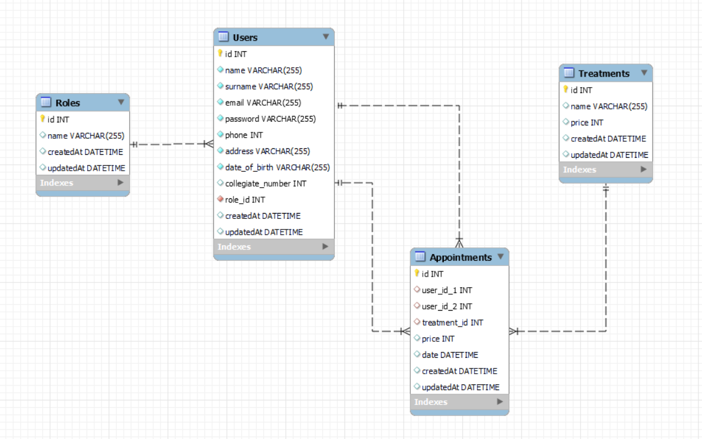

# Backend Clinica Dental - Laravel

<details>
  <summary>Contenido 📝</summary>
  <ol>
    <li><a href="#objetivo">Objetivo</a></li>
    <li><a href="#sobre-el-proyecto">Sobre el proyecto</a></li>
    <li><a href="#stack">Stack</a></li>
    <li><a href="#diagrama-bd">Diagrama</a></li>
    <li><a href="#instalación-en-local">Instalación</a></li>
    <li><a href="#endpoints">Endpoints</a></li>
    <li><a href="#licencia">Licencia</a></li>
    <li><a href="#agradecimientos">Agradecimientos</a></li>
    <li><a href="#contacto">Contacto</a></li>
  </ol>
</details>

## Objetivo

En el siguiente proyecto se ha creado el backend para el sistema de gestión de citas de una clínica dental. Se ha realizado en un entorno educativo para GeeksHubs Academy utilizando Laravel.

## Sobre el proyecto

Las funciones que se pueden realizar en la API serán tanto el registro de usuarios como su login. A la hora de hacer el registro se asignará el rol de paciente de forma automática, aunque si se trata de un dentista o administrador podremos cambiar su rol en la base de datos para que puedan acceder a diferentes endpoints.

Al hacer login recibiremos un token que deberemos insertar en los diferentes endpoints para poder tener acceso.

Como paciente podremos ver nuestro perfil de usuario, modificarlo y borrarlo. Podremos consultar los diferentes tratamientos que se ofrecen así como los diferentes dentistas de la clínica, y con esa información podremos crear una cita. También seremos capaces de modificarla o borrarla. Una vez creada la cita la podremos consultar de forma individual o, si tenemos más de una, de forma conjunta.

Los dentistas además pueden ver la lista de todos los pacientes y todas las citas a su nombre.

Los administradores también podrán ver el listado de todas la citas creadas, restaurar una cuenta borrada, y crear, modificar y borrar los tratamientos.

## Stack

Tecnologías utilizadas:

<div align="center">

    

</div>

## Diagrama BD



## Instalación en local

1. Clona el repositorio `$git clone 'url-repository'`
2. Instala las dependencias `composer install`
3. Crea el archivo `.env` y configura la base de datos
4. Ejecuta las migraciones y seeders `php artisan migrate` `php artisan db:seed`
5. Conectamos el servidor`php artisan serve`
6. Ejecuta este archivo en Postman para habilitar el acceso a los endpoints del proyecto: [](https://app.getpostman.com/run-collection/27848134-8edb8156-41a0-4433-984a-adc838cc7a2a?action=collection%2Ffork&source=rip_markdown&collection-url=entityId%3D27848134-8edb8156-41a0-4433-984a-adc838cc7a2a%26entityType%3Dcollection%26workspaceId%3Dd21a4afd-fecf-498d-817a-74ca421ad0c8)

## Endpoints

<details>
<summary>Endpoints</summary>

-   AUTH

    -   REGISTER

              POST http://localhost:8000/api/register

        body:

        ```js
            {
                "name": "Andrea",
                "surname": "Suarez",
                "email": "andrea@andrea.com",
                "password": "Andrea123!",
                "phone": 666666666,
                "address": "C/ Denia 1",
                "date_of_birth": "1991-01-01"
            }
        ```

    -   LOGIN

              POST http://localhost:8000/api/login

        body:

        ```js
            {
                "email": "andrea@andrea.com",
                "password": "Andrea123!"
            }
        ```

-   PROFILE

    -   GET PROFILE

              GET localhost:8000/api/profile

    -   UPDATE PROFILE

              PUT localhost:8000/api/profile

        body: (Solo se puede modificar el email, teléfono y dirección)

        ```js
            {
                "email": "andrea@andrea.com",
                "phone": "612345678",
                "address": "C/ Denia 4"
            }
        ```

    -   DELETE PROFILE

              DELETE localhost:8000/api/profile

    -   RESTORE PROFILE (Solo como admin)

              POST localhost:8000/api/profile/:id

    -   GET PROFILE DE TODOS LOS USUARIOS (Solo como admin)

              GET localhost:8000/api/users

    -   GET PROFILE DE TODOS LOS PACIENTES (Solo como admin)

              GET localhost:8000/api/patients

    -   GET PROFILE DE TODOS LOS DENTISTAS

              GET localhost:8000/api/dentists

-   APPOINTMENTS

    -   CREATE APPOINTMENT

              POST localhost:8000/api/appointments

        body: (Necesitaremos el id del dentista, el id del tratamiento y la fecha)

        ```js
            {
                "user_id_2": 4,
                "treatment_id": 8,
                "date": "2023-06-10 17:00:00",
            }
        ```

    -   UPDATE APPOINTMENT

              PUT localhost:8000/api/appointments/:id

        body:

        ```js
            {
                "user_id_2": 4,
                "treatment_id": 9,
                "date": "2023-06-10 18:30:00",
            }
        ```

    -   DELETE APPOINTMENT

              DELETE localhost:8000/api/appointments:id

    -   GET ALL APPOINTMENTS (Solo como admin)

              GET localhost:8000/api/appointments

    -   GET DOCTOR APPOINTMENTS (Solo como dentista, veremos solo sus propias citas)

              GET localhost:8000/api/appointments/doctor

    -   GET PATIENT APPOINTMENTS (Solo como paciente, veremos solo sus propias citas)

              GET localhost:8000/api/appointments/patient

    -   GET ONE APPOINTMENT (Para ver una cita especifica)

              GET localhost:8000/api/appointments/:id

-   TREATMENTS

    -   GET ALL TREATMENTS

              GET localhost:8000/api/treatments

    -   CREATE TREATMENT (Solo como admin)

              POST localhost:8000/api/treatments

        body:

        ```js
            {
                "name": "Primera visita",
                "price": 25,
            }
        ```

    -   UPDATE TREATMENT (Solo como admin)

              PUT localhost:8000/api/treatments:id

        body:

        ```js
            {
                "name": "Primera visita",
                "price": 20,
            }
        ```

    -   DELETE TREATMENT (Solo como admin)

              DELETE localhost:8000/api/treatments:id

</details>

## Licencia

Este proyecto se encuentra bajo licencia MIT.

## Agradecimientos:

Agradezco a mis profesores por sus clases, que han hecho posible que realice este proyecto:

-   **Mara**  
    <a href="https://github.com/MaraScampini" target="_blank"></a>

-   **Dani**  
    <a href="https://github.com/Datata" target="_blank"></a>

## Contacto

<a href = "mailto:andrea.sualo@gmail.com"></a>
